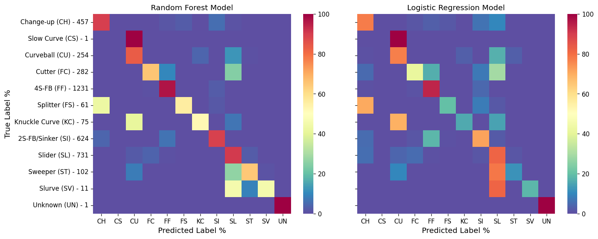
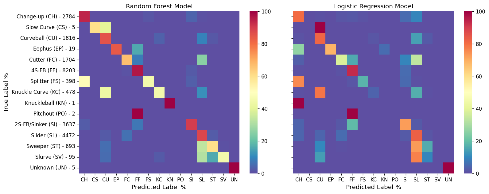

# MLB pitch classifier
This script takes two months worth of statcast data from the 2022 season (~250,000 pitches) and builds two machine learning models (Random Forest and Logistic Regression) to determine what type of pitch is thrown. 
The data is cleaned and processed such that only the fields that make sense to a distinct pitch are used. 

These include:
* Release Speed
* Release spin rate
* Spin axis
* Velocity x, y, and z vectors at 50 feet from home plate
* Acceleration x, y, and z vectors at 50 feet from home plate
* Horizontal and vertical movement

The package used for accessing the statcast data is: https://pypi.org/project/baseball-scraper/

Pitch_Data_small.csv file is provided since accessing the statcast data can take some time, so just import the .csv into pandas for faster use.

## Results on small data set of 10 days (provided)
The accuracy score results of the small data set are:
* RandomForest was 0.87781, in a time of 7.40s
* LogisticRegression was 0.76005, in a time of 1.43s

Heat map charts below show the two models' results where the left axis shows the pitch name and how many instances were found in the test set. There is a lot of agreement in the two models but the Random Forest is more accurate while the Logistic Regression is much faster.

## Results on larger Data set 2 months (.csv is too large for github)
**Note that more pitch types are found in the larger set**

The accuracy score results of the larger data set are:
* RandomForest was 0.87607, in a time of 59.46s
* LogisticRegression was 0.76279, in a time of 77.23s

Same charts as above. This tiem the Random forest is both faster and more accurate than the Logistic Regression (Both are pretty slow still).

## Points of interest
* The "Slow Curve" pitch is found to be a "Curveball" quite often so could be lumped in (also only 5 instances).
* "Pitch outs" are alwasy found as "Fastballs" which makes since that a PO is thrown to try and stop a runner from stealing so it is essentially a fastball outsie the zone.
* "Slider", "Sweeper", "Cutter" and "Slurve" all have a lot of overlap as all those pitches have similar movement where then have a lot of horizonatal break compared to all the others.
* The"Eephus" and "Fastball"should not overlap at all as they are complete opposite pitches but I would assume there is some odd behavior with the addition of position players throwing as slow as possible and having "Eephus" and "Fastballs" overlap.
